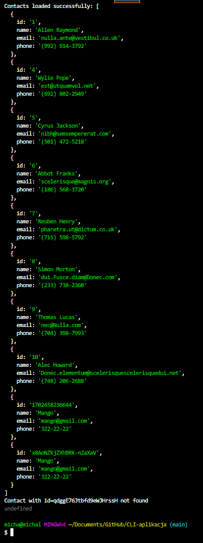

Description:

CLI Contacts Manager is a simple Command Line Interface (CLI) that allows you to manage a list of contacts. The application supports basic contact operations such as displaying a list, adding a new contact, removing a contact, and fetching contact details based on an identifier.

Project Structure:


Gallery




Installation:

Include instructions on how to install the necessary dependencies, if any.
If there are specific node modules or packages required, mention how to install them using npm.
Usage:

Provide more detailed examples of how to use each command.
Add screenshots or gifs to illustrate the expected output for each command.
Development:

Include information on how to set up the development environment.
Explain any additional tools or configurations needed during development.
Contributing:

If you're open to contributions, mention how others can contribute to the project.
License:

Specify the license under which the project is released.
Here's an example template you can use:

markdown
Copy code

# CLI Contacts Manager

## Description

CLI Contacts Manager is a simple Command Line Interface (CLI) for managing contacts.

## Installation

```bash
npm install
Usage
List Contacts
bash
Copy code
node index.js --action list
Displays a table with all contacts stored in the contacts.json file.

Get Contact
bash
Copy code
node index.js --action get --id [CONTACT_ID]
Fetches and displays the details of a contact based on the provided identifier.

...

Development
Clone the repository.
Install dependencies:
bash
Copy code
npm install
Run in development mode:
bash
Copy code
npm run start:dev
Contributing
Contributions are welcome! Please follow the Contributing Guidelines.

License
This project is licensed under the MIT License.

css
Copy code

Feel free to customize it further based on the specific details of your project.


```
